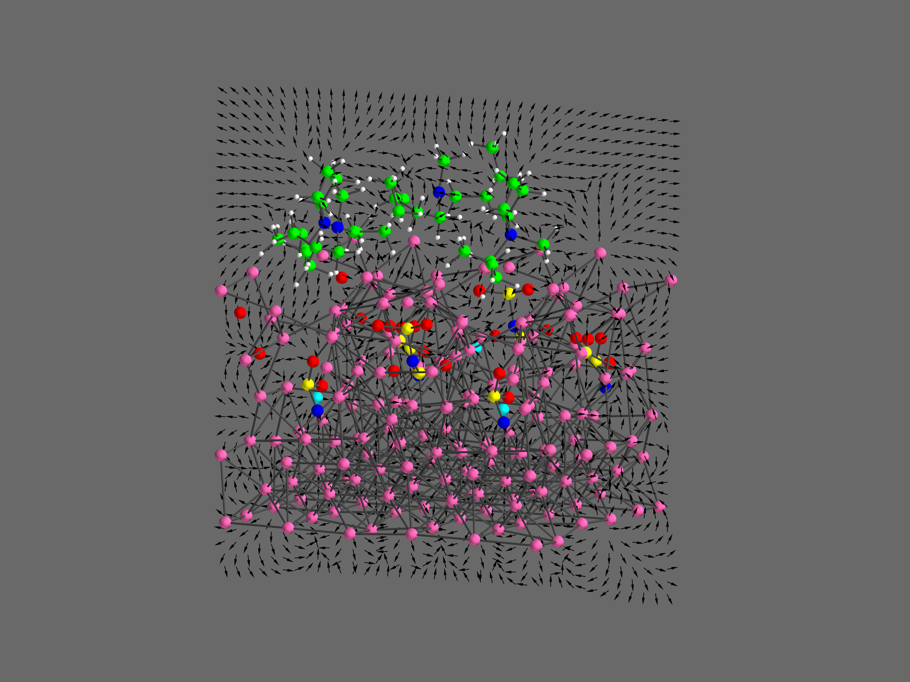

# Electric Field Slice Visualizer
Visualize electric-field vectors from Gaussian `.cube` potential grids, with atoms/bonds and slice planes (XY/XZ/YZ).

# PIP install
pip install -r requirements.txt

# Run
python src/efield_visualizer

# Adjusting parameters
Define how the Electric Field arrows are printed and on which plane
```python
# ================== User-configurable parameters ===============================================
density = 3          # Arrow spacing (higher = sparser)
arrow_len = 1.0      # Constant arrow length
arrow_thickness = 4  # Thickness of arrows
slice_coord = 20.0   # Real-space coordinate for slicing (e.g., in angstroms)
plane = 'YZ'         # Options: 'XY', 'XZ', 'YZ'
```

Name of the cube file loaded
```python
if __name__ == "__main__":
    cube_filename = "totesp.cub"  # Replace with your .cube file
    X, Y, Z, V, atoms = read_cube_file(cube_filename)
```

Change the resolution of the image, in this case is set to 1600×1200:
```python
    #======================Add key press binding to save high-res transparent PNG============
    def save_highres(obj=None, evt=None):
        mlab.savefig("field_visualization.png", size=(1600, 1200), magnification=3)
        print("High-res image saved as 'field_visualization.png'")
```
# Press any key to save the image (field_visualization.png)

